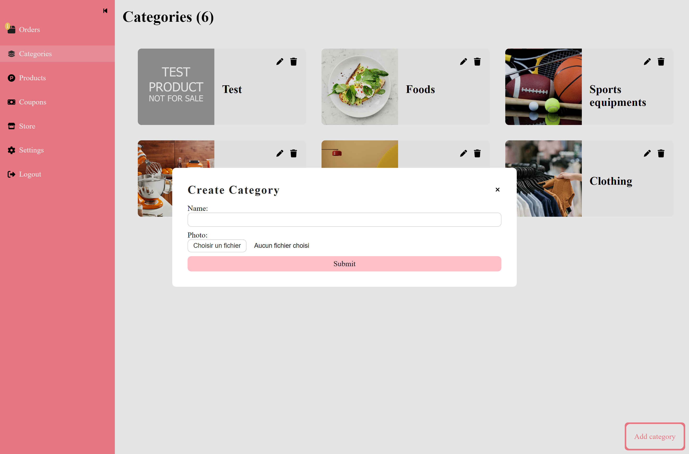

# Shoppin'on

Shoppin'on is a user-friendly e-commerce platform designed to help businesses manage and sell their products online. It combines both the storefront and the dashboard, allowing store owners to efficiently manage their operations.

## Table of contents

- [Shoppin'on](#shoppinon)
  - [Table of contents](#table-of-contents)
  - [Overview](#overview)
    - [Functionalities](#functionalities)
    - [Screenshot](#screenshot)
  - [My process](#my-process)
    - [Built with](#built-with)
  - [Note](#note)
  - [Author](#author)

## Overview

### Functionalities

The system includes two main roles:

*Administrator/Store Owner:*

- Login and Update Information
- Manage Categories: Create, edit, and delete categories for better organization.
- Manage Products: Add, edit, and remove products.
- Manage Coupons: Create and manage promotional coupons to attract customers.
- Manage Orders: View, process, and fulfill customer orders efficiently.
- Logout
  
*Buyer/Online User:*

- Browse Categories: Explore a wide range of products categorized.
- Search and Filter Products: Find specific items using intuitive search functionality and filter options.
- Create Favorites: Build personalized lists of desired products for future purchases.
- Manage Cart: Add, remove, and update items in the shopping cart.
- Manage order: Place orders, cancel orders and track orders status.

### Screenshot

Dashboard:

ORDER MANAGEMENT

|  |
| :-----------------------------------------------------: |

CATEGORY MANAGEMENT

|  |  |
| :-----------------------------------------------------: | :-----------------------------------------------------: |

PRODUCT MANAGEMENT

|  |  |
| :-----------------------------------------------------: | :-----------------------------------------------------: |

COUPON MANAGEMENT

|  |  |
| :-----------------------------------------------------: | :-----------------------------------------------------: |

PROFILE MANGEMENT

|  |
| :-----------------------------------------------------: |

Store:

HOME

|  |  |
| :-----------------------------------------------------: | :-----------------------------------------------------: |

CATEGORIES

|  |
| :-----------------------------------------------------: |

PRODUCTS

|  |  |
| :-----------------------------------------------------: | :-----------------------------------------------------: |

HOT OFFERS

|  |
| :-----------------------------------------------------: |

BEST SELLERS

|  |
| :-----------------------------------------------------: |

FAVORITES

|  |
| :-----------------------------------------------------: |

ORDERS

|  |  | |
| :-----------------------------------------------------: | :-----------------------------------------------------: |:-----------------------------------------------------: |

LOGIN

|  |
| :-----------------------------------------------------: |

## My process

### Built with

- **Frontend:**
  - Angular ([https://angular.io/])
- **Backend:**
  - Node.js ([https://nodejs.org/en])
  - Express.js ([https://expressjs.com/])
- **Database:**
  - MongoDB ([https://www.mongodb.com/])

## Note

Before running this project, please ensure the necessary environment variables are set up in the backend folder. Specifically, add the connection string of your MongoDB database to the **config.env** file.

## Author

- Frontend Mentor - [@wess-MHHW](https://www.frontendmentor.io/profile/wess-MHHW)
- LeetCode - [@wess-MHHW](https://leetcode.com/wess-MHHW/)
- Linkedin - [@wassim-maaoui](https://www.linkedin.com/in/wassim-maaoui/)
